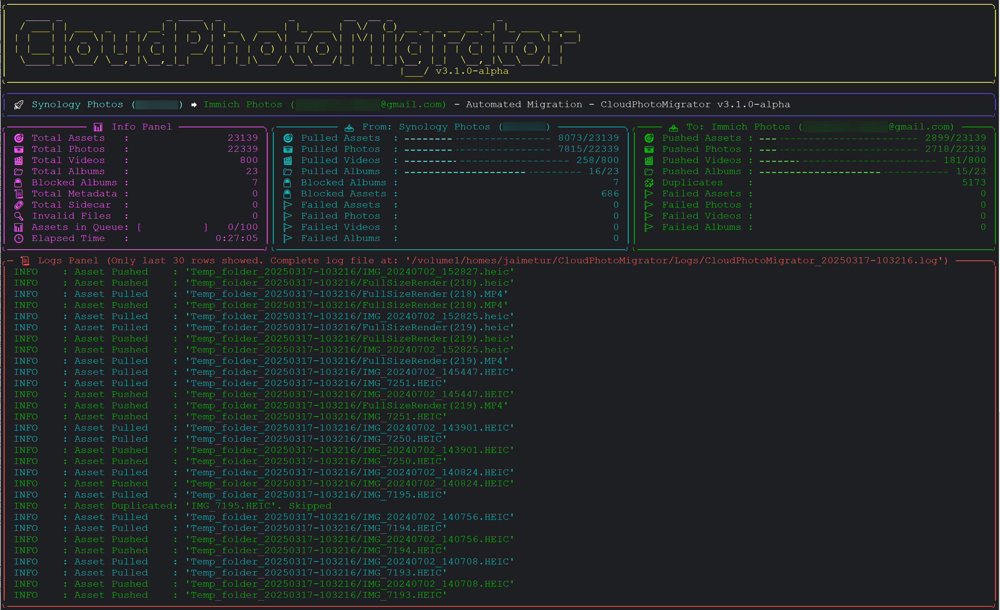

# 🚀 Automatic Migration Feature

From version 3.0.0 onwards, the Tool supports a new Feature called '**Automatic Migration**'. 

Use the argument **`--source`** to select the `<SOURCE>` client and the argument **`--target`** to select `<TARGET>` client for the Automatic Migration Process to Pull all your Assets (including Albums) from the `<SOURCE>` Cloud Service and Push them to the `<TARGET>` Cloud Service (including all Albums that you may have on the `<SOURCE>` Cloud Service).

 - Possible values for:
   - **`<SOURCE>`** : [`synology-photos`, `immich-photos`, `nextcloud-photos`, `google-photos`]-[id] or `<INPUT_FOLDER>`  (`id=[1, 2, 3]` to select which account to use from the `Config.ini`).  
   - **`<TARGET>`** : [`synology-photos`, `immich-photos`, `nextcloud-photos`, `google-photos`]-[id] or `<INPUT_FOLDER>`  (`id=[1, 2, 3]` to select which account to use from the `Config.ini`).  
   

 - Google Photos is now available as a partial cloud endpoint (official API limitations apply).

> [!IMPORTANT]
> Since **2025-04-01**, Google Photos full-library reads are no longer available to third-party apps through the official Library API. PhotoMigrator therefore blocks `Automatic Migration` when `Google Photos` is used as `<SOURCE>`. Use **Google Takeout** as `<SOURCE>` instead, or use Google Photos as `<TARGET>` only.

If you omit the suffix -[id], the tool will assume that account 1 will be used for the specified client (ie: `--source=synology-photos` means that Synology Photos account 1 will be used as `<SOURCE>` client.)  

Also, you can omit the suffix -photos in both **`<SOURCE>`** and **`<TARGET>`** clients, so, you can just use `--source=synology` `--target=nextcloud` to set Synology Photos account 1 as `<SOURCE>` client and NextCloud Photos account 1 as `<TARGET>` client.  

It is also possible to specify the account-id using the argument _**`-id, --account-id <ID>`**_ (ie: --source=synology --account-id=2 means that Synology Photos account 2 will be used as `<SOURCE>` client.)  

> [!IMPORTANT]  
> Take into account that the argument _**`-id, --account-id <ID>`**_ applies for all cloud services (Synology, Immich, NextCloud and Google Photos), so if you specify the client ID using this argument, all of them will use the same client ID unless you set explicit `-1/-2/-3` suffix in source/target.

By default, the whole Migration process is executed in parallel using multi-threads (it will detect automatically the number of threads of the CPU to set properly the number of Push workers). The Pull worker and the different Push workes will be executed in parallel using an assets queue to guarantee that no more than 100 assets will be temporarily stored on your local drive, so you don't need to care about the hard disk space needed during this migration process.  

By default, (if your terminal size has enough width and height) a Live Dashboard will show you all the details about the migration process, including most relevant log messages, and counter status. You can disable this Live Dashboard using the argument **`-dashboard=false or --dashboard=false`**.   

If either `<SOURCE>` or `<TARGET>` is `Synology Photos`, you can also include **`-OTP, --one-time-password`** to allow the login flow to request a 2FA one-time-password token when needed.

When the destination is Immich, you can include **`--import-people`** to import people labels from a Google Takeout source or a local source folder that contains `takeout_people_metadata.json`. A raw local folder with Google JSON sidecars is also supported. A raw Google Takeout source is processed first and produces this map automatically when `--google-process-people=true` (the default).

Google Takeout provides person names and capture dates, but not face rectangles. PhotoMigrator creates or reuses the named people in Immich and only reassigns labels when Immich reports the same number of unassigned detected faces as Takeout labels. If the counts differ or face detection is not yet available, the asset is left unchanged and the reason is logged.

When enabled, the migration log reports `Google Takeout people map loaded (N assets)`. Each `Asset Pushed` or `Asset Duplicated` line for a mapped asset includes `People found: N`. For such duplicates, PhotoMigrator resolves the existing Immich asset ID before attempting the person import, so a rerun can also apply labels to assets that Immich had already stored.

Additionally, this Automatic Migration process can also be executed sequentially instead of in parallel, using argument **`--parallel-migration=false`**, so first, all the assets will be pulled from `<SOURCE>` and when finish, they will be pushed into `<TARGET>`, but take into account that in this case, you will need enough disk space to store all your assets pulled from `<SOURCE>` service.

By default, destination albums are only reused when the existing target album name matches exactly, and newly created albums keep the original source name.

If you include **`--prefer-canonical-album-names`**, PhotoMigrator normalizes newly created destination album names to the preferred clean keeper form even when the target does not already contain a similar album.

If you include **`--consolidate-similar-albums`**, PhotoMigrator also treats equivalent album families as reusable even when they differ only by harmless formatting or duplicate-like suffixes.

Examples that are treated as the same family:
- `Album`, `Album_1`, `Album (2)`, `Album_5`
- `New_Album`, `New Album`, `New_Album 1`

Behavior on cloud targets:
- PhotoMigrator prefers the clean keeper name without a numeric suffix and with spaces instead of underscores.
- Even when the target does not already contain a similar album, new destination albums are created directly with that preferred clean keeper name (for example `Album_1` becomes `Album`, and `New_Album 1` becomes `New Album`).
- If needed, it creates that preferred keeper and merges the assets from the redundant variants into it.
- `Immich`, `Synology`, and `NextCloud` then remove the redundant albums after the consolidation is confirmed by the target.
- `Google Photos` also consolidates into the preferred keeper, but the redundant albums remain because the public Library API does not support deleting albums.

Practical scenarios:
- No flags: if the source album is `Album_1` and the target only has `Album`, PhotoMigrator still creates `Album_1`.
- Only `--prefer-canonical-album-names`: if the source album is `Album_1` and the target has no matching exact `Album_1`, PhotoMigrator normalizes the destination to `Album`. If `Album` already exists exactly, it reuses that `Album`.
- Only `--consolidate-similar-albums`: if the target already contains `Album`, `Album_1`, and `Album (2)`, PhotoMigrator consolidates that family into the preferred keeper `Album`. If the target contains none of them, a source `Album_1` is kept as `Album_1`.
- Both flags together: new albums are normalized to the preferred keeper form and any existing similar family is also consolidated into that same keeper.

Finally, you can apply filters to filter assets to pull from `<SOURCE>` client. The available filters are: 
   - **by Type:**
     - argument: `-type, --filter-by-type`
       - Valid values are [`image`, `video`, `all`]
   - **by Dates:**
     - arguments:
       - `-from, --filter-from-date`
       - `-to, --filter-to-date`
     - Valid values are in one of those formats: 
       - `dd/mm/yyyy`
       - `dd-mm-yyyy`
       - `yyyy/mm/dd`
       - `yyyy-mm-dd`
       - `mm/yyyy`
       - `mm-yyyy`
       - `yyyy/mm`
       - `yyyy-mm`
       - `yyyy `
   - **by Country:**
     - argument: `-country, --filter-by-country`
       - Valid values are any existing country in the `<SOURCE>` client.
   - **by City:**
     - argument: `-city, --filter-by-city`
       - Valid values are any existing city in the `<SOURCE>` client.
   - **by Person:**
     - argument: `-person, --filter-by-person`
       - Valid values are any existing person in the `<SOURCE>` client.
   - **by Exclusion Patterns:**
     - arguments:
       - `-exFolders, --exclude-folders`
       - `-exFiles, --exclude-files`
     - Valid values are glob patterns and multiple values are allowed.
     - Example:
       - `--exclude-folders @eaDir .@__thumb @Recycle`
       - `--exclude-files SYNOFILE_THUMB* SYNOPHOTO_THUMB* SYNOPHOTO_FILM* Thumbs.db .DS_Store`

## How asset counters are counted

All live dashboard counters and final summary counters in `Automatic Migration` are intended to follow **physical files**, not abstract logical entities.

This means:
- `Total Assets`, `Total Photos`, `Total Videos`
  - represent the physical media files discovered in the source analysis.
- `Pulled Assets`, `Pulled Photos`, `Pulled Videos`
  - represent the physical files that were actually staged locally after pull.
- `Pushed Assets`, `Pushed Photos`, `Pushed Videos`
  - represent the physical files that were successfully uploaded or accepted by the destination.
- `Push Duplicates`
  - represent physical files that did not need a new upload because the destination already had a reusable equivalent.
- `Pull Failed` / `Push Failed`
  - represent physical files whose pull or upload path really failed.

Practical examples:
- A normal JPEG counts as:
  - `1 asset`
  - `1 photo`
- A normal MP4 counts as:
  - `1 asset`
  - `1 video`
- A live-photo pair composed of `IMG_0001.JPG` + `IMG_0001.MP4` counts as:
  - `2 assets`
  - `1 photo`
  - `1 video`

This is important because all cleanup behavior, temp leftovers, retries, duplicates, and final manual review happen on the real files stored on disk.

## Meaning of the live dashboard counters

### Info Panel
- `Total Assets`
  - all supported physical media files considered for migration after source analysis.
- `Total Photos`
  - physical image files.
- `Total Videos`
  - physical video files.
- `Total Albums`
  - source albums detected before the migration starts.
- `Blocked Albums`
  - albums that the current source backend can detect but cannot actually process.
  - in practice this mainly applies to blocked/shared `Synology` album cases.
- `Blocked Assets`
  - physical assets inside those blocked albums.
- `Total Metadata`
  - metadata files detected in the source analysis, such as Google Takeout JSON sidecars or real iCloud metadata CSV files.
- `Total Sidecar`
  - sidecar files detected in the source analysis.
- `Unknown Files`
  - files that were found in the source tree but do not match supported media, metadata, or sidecar categories.
- `Assets in Queue`
  - only the real push queue backlog waiting for upload workers.
- `Album Assoc Queue`
  - assets already uploaded or resolved that are still waiting for destination album association/finalization work.
- `Delayed Retries`
  - delayed retry items not yet re-enqueued into the hot push pipeline.

### Pull Panel
- `Pulled Assets / Photos / Videos`
  - physical files already staged locally.
- `Pulled Albums`
  - source albums already fully pulled.
- `Failed Assets / Photos / Videos`
  - physical files that could not be pulled.
- `Failed Albums`
  - source albums that could not be processed as album units.

### Push Panel
- `Pushed Assets / Photos / Videos`
  - physical files successfully uploaded or otherwise accepted in the destination.
- `Pushed Albums`
  - albums fully finalized in the target.
- `Duplicates`
  - physical files that were skipped because the destination already had a reusable equivalent.
- `Failed Assets / Photos / Videos`
  - physical files whose upload/reuse resolution path ultimately failed.
- `Delayed Recovered`
  - physical files that succeeded after having been scheduled into the delayed retry queue.
- `Delayed Failed`
  - physical files whose delayed upload retry path was exhausted without recovery.
- `Album Assoc Unconfirmed`
  - not a hard upload failure.
  - it means the media file did reach or resolve in the destination, but PhotoMigrator could not confirm that it was finally attached to the intended album after all association retries.


> [!WARNING]  
> If you use a local folder `<INPUT_FOLDER>` as source client, all your Albums should be placed into a subfolder called *'<ALBUMS_FOLDER>'* within `<INPUT_FOLDER>`, creating one Album subfolder per Album, otherwise the tool will no create any Album in the target client.  
>
> Example:  
> `<INPUT_FOLDER>/<ALBUMS_FOLDER>/Album1`  
> `<INPUT_FOLDER>/<ALBUMS_FOLDER>/Album2`  
>
> If the same local source also contains a top-level `Memories` folder, PhotoMigrator will treat each subfolder inside `Memories` exactly like an album and migrate it to the target too.

> [!TIP]
> If `--source` points to a raw Apple iCloud Takeout export, PhotoMigrator now detects it automatically, preprocesses it first, and only then starts the normal Automatic Migration upload flow.

## Meaning of files left in the temp folder after migration

`Automatic Migration` uses a temp working folder named like:

```text
Automatic_Migration_Push_Failed_<TIMESTAMP>
```

At the end of a clean migration, that folder should normally disappear or be reduced to only expected housekeeping artifacts during runtime.

If files remain there after the migration finishes, they mean something specific:

- Files left directly inside the normal temp staging tree
  - these usually represent assets whose upload/reuse/finalization path did not complete successfully.
  - they are the first place to inspect when `Push Failed Assets` is greater than zero.

- Files preserved under:
  - `Album Association Failed/<AlbumName>/`
  - these assets were **uploaded successfully** (or resolved successfully as duplicates/reusable destination assets), and if `--move-assets=true` they may already have been removed from the original source too.
  - however, PhotoMigrator could not confirm their final membership inside the destination album named `<AlbumName>`.
  - they are therefore kept on disk for audit/manual review instead of being deleted silently.

- Empty or nearly empty temp folders
  - these are cleaned automatically at the end.
  - folders that only contain ignorable runtime/system artifacts such as `.active`, `*.lock`, `@eaDir`, `.DS_Store`, or similar excluded files are also considered removable during cleanup.

Practical interpretation:
- `Push Failed Assets > 0`
  - inspect the normal temp leftovers first.
- `Album Assoc Unconfirmed > 0`
  - inspect `Album Association Failed/<AlbumName>/` first.
- source files removed but temp files still present under `Album Association Failed`
  - expected when the media itself was migrated but the album attachment could not be confirmed.

> [!IMPORTANT]  
> It is important that you configure properly the file `Config.ini` (included with the tool), to set properly the accounts for your Photo Cloud Service.  

> [!NOTE]
> For compiled binaries, macOS now uses `PhotoMigrator.command`. Linux and Synology SSH continue using `PhotoMigrator.bin`. Replace the binary name accordingly when following the CLI examples below.


## Live Dashboard Preview:



## **Examples of use:**

- **Example 1:**
```
./PhotoMigrator.bin --source=/homes/MyTakeout --target=synology-1
```

In this example, the Tool will do an Automatic Migration Process which has two steps:  

  - First, the Tool will process the folder '/homes/MyTakeout' (Unzipping them if needed), fixing all files found on it, to set the
    correct date and time, and identifying which assets belongs to each Album created on Google Photos.  

  - Second, the Tool will connect to your Synology Photos account 1 (if you have configured properly the Config.ini file) and will 
    push all the assets pulled from previous step, creating a new Album per each Album found in your Takeout files and associating
    all the assets included in each Album in the same way that you had on your Google Photos account.


- **Example 2**:
```
./PhotoMigrator.bin --source=synology-2 --target=immich-1
```

In this example, the Tool will do an Automatic Migration Process which has two steps:  

  - First, the Tool will connect to your Synology Photos account 2 (if you have configured properly the Config.ini file) and will
    pull all the assets found in your account (separating those associated to som Album(s), of those without any Album associated).  

  - In parallel, the Tool will connect to your Immich Photos account 1 (if you have configured properly the Config.ini file) and 
    push all the assets pulled from previous step, creating a new Album per each Album found in your Synology Photos and associating
    all the assets included in each Album in the same way that you had on your Synology Photos account.


- **Example 3**:
```
./PhotoMigrator.bin --source=immich-2 --target=/homes/local_folder --filter-by-person=Peter --filter-from-date=2024
```

In this example, the Tool will do an Automatic Migration Process which has two steps:  

  - First, the Tool will connect to your Immich Photos account 2 (if you have configured properly the Config.ini file) and will
    pull all the assets found in your account where Peter have been labeled as person, and whose date is after 01/02/2024 (separating those associated to som Album(s), of those without any Album associated).  

  - In parallel, the Tool will push all the pulled assets into the local folder '/homes/local_folder' creating a folder structure
    with all the Albums in the subfolder '<ALBUMS_FOLDER>' and all the assets without albums associated into the subfolder '<NO_ALBUMS_FOLDER>'. 
    This '<NO_ALBUMS_FOLDER>' subfolder will have a year/month structure to store all your asset in a more organized way.  


- **Example 4**:
```
./PhotoMigrator.bin --source=immich-1 --target=immich-2 --filter-by-city=Rome --filter-by-person=Mery
```

In this example, the Tool will do an Automatic Migration Process which has two steps:  

  - First, the Tool will connect to your Immich Photos account 1 (if you have configured properly the Config.ini file) and will
    pull all the assets found in your account that have been taken in Rome and where Mery have been labeled as person (separating those associated to som Album(s), of those without any Album associated).  

  - In parallel, the Tool will connect to your Immich Photos account 2 (if you have configured properly the Config.ini file) and 
    push all the assets pulled from previous step, creating a new Album per each Album found in your Synology Photos and associating
    all the assets included in each Album in the same way that you had on your Synology Photos account.


- **Example 5**:
``` 
./PhotoMigrator.bin --source=/homes/iCloudExport --target=immich-1 --icloud-include-memories
```

In this example, the Tool will first detect that `/homes/iCloudExport` is a raw Apple iCloud Takeout export, preprocess it automatically, and then migrate the resulting `ALL_PHOTOS`, `Albums`, and `Memories` collections into your Immich Photos account 1. When iCloud preprocessing is triggered automatically from `Automatic Migration`, `Memories` are enabled by default even if the CLI call did not explicitly pass `--icloud-include-memories`. If the local source contains ZIP files, the Tool unpacks them first and only then decides whether the extracted folder is a Google Takeout, an iCloud Takeout, or a normal local folder.


- **Example 6**:
```
./PhotoMigrator.bin --source=/homes/MyTakeout --target=synology-1 --prefer-canonical-album-names --consolidate-similar-albums
```

If the target already contains albums such as `Album_1`, `Album (2)`, and `Album_5`, and the source migration wants to create/use `Album`, PhotoMigrator will treat them as the same album family. It will prefer the clean keeper name `Album`, merge the assets from the numbered variants into that keeper, and continue assigning the incoming source assets to `Album`. On `Immich`, `Synology`, and `NextCloud`, the redundant variants are removed after the consolidation is confirmed. On `Google Photos`, the redundant variants remain because the public API cannot delete albums.

If the target does not yet contain any `Album*` variant and the source migration wants to create/use `Album_1`, the same flag still normalizes the destination name and creates `Album` directly instead of preserving the duplicate-like suffix.

---
## ⚙️ Config.ini
You can see how to configure the Config.ini file in this help section:
[Configuration File](00-configuration-file.md) 

---
## 🏠 [Back to Main Page](../README.md)
    
---
## 🎖️ Credits:
I hope this can be useful for any of you. Enjoy it!

<span style="color:grey">(c) 2024-2026 by Jaime Tur (@jaimetur).</span>   
